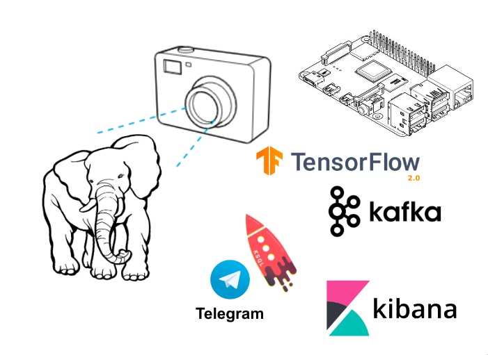
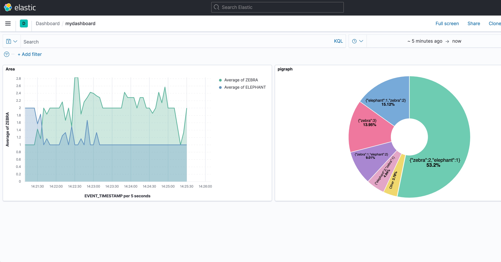
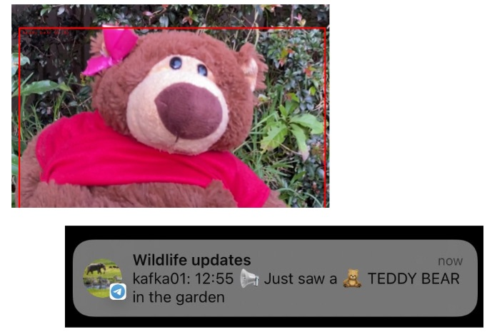

# Wildlife monitoring
Wildlife monitoring is essential for keeping track of animal movement patterns & population change. The tricky part however can be finding &  identifying every species. 



This project is a demonstration of using a raspberry Pi and camera,
Apache Kafka, Kafka Connect to identify and classify animals. Using ksqlDB to see population trends over time and the display of real-time analytics on this data with  Kibana dashboards. Plus instant alerting using Telegram to send me a push notification to my phone if we discovered a rare animal


# Setup Rasperry Pi / Kafka Producer

This code has been tested on a Raspberry Pi 4 and MacBook Pro (Intel) with Python 3.7.4 and pip 22.1.2 

This example uses TensorFlow Lite with Python on a Raspberry Pi to perform real-time object detection using images streamed from the Pi Camera. Much inspiration taken from the [TensorFlow Lite Python object detection example](https://github.com/tensorflow/examples/tree/master/lite/examples/object_detection/raspberry_pi)


### Download the EfficientDet-Lite mode
Download a pre-trained TensorFlow Lite - which can detect elepahnts, cats etc.,
```bash
curl -L 'https://tfhub.dev/tensorflow/lite-model/efficientdet/lite0/detection/metadata/1?lite-format=tflite'     -o efficientdet_lite0.tflite
```


## Setup virtual python environment 
 ```bash
virtualenv -p `which python3` venv
source venv/bin/activate
python --version
pip --version
```

## Install requirements
```bash
python3 -m pip install pip --upgrade
python3 -m pip install -r requirements.txt
```

## Run detection loop
Run the detection loop using the camera
```bash
python3 detect.py
```

Run the detection loop using the sample video file
```bash
python detect.py --videoFile ./demowildlife.mp4
```


# Setup Kafka, Kafka Connect and Kibana
These instructions are for running Kafka, Kafka Connect and Kibana locally using docker containers

## Download Kafka connect sinks
Download the [http](https://www.confluent.io/hub/confluentinc/kafka-connect-http) and [elasticsearch](https://www.confluent.io/hub/confluentinc/kafka-connect-elasticsearch) Kafka connect sink adapters (note: licensed)

```bash
cd connect_plugin
unzip ~/Downloads/confluentinc-kafka-connect-http-*.zip
unzip ~/Downloads/confluentinc-kafka-connect-elasticsearch-*.zip
cd ..
```


## Start docker containers
```bash
docker compose up -d
```

## Configure brokers
Edit the file [detect.ini](detect.ini) for settings of kafka broker and name of camera


## Check connector-plugins are avaiable
Check the http and elasticsearch Kafka connect sink adapters are available

```bash
curl -s "http://localhost:8083/connector-plugins" | jq '.'
```


## Setup topics
Create Kafka topics and populate with dummy data

```bash
./01_create_topic
```

## Setup KSQL streams
Connect to ksqlDB server and create streams

```bash
ksql
run script './02_ksql.ksql';
```
 
## Load Elastic Dynamic Templates
Load Elastic Dynamic Templates - ensure fields suffixed with `TIMESTAMP` are created as dates

```bash
./03_elastic_dynamic_template
```

## Setup Kafka connect sink to elastic
Ensure the `animals` and `zoo` topics are sent from kafka to elastic

```bash
./04_kafka_to_elastic_sink
```

## Create indexes in Kibana
Create indexes in Kibana

```bash
./05_create_kibana_metadata.sh
```

Can check Kibana index by visiting http://localhost:5601/app/management/kibana/indexPatterns


## Create a visulization
Go to http://localhost:5601/app/lens to create a visulization and dashboard

Or - go to http://localhost:5601/app/management/kibana/objects and select _Import saved objects_ and upload `06_kibana_export.ndjson`



# Setup Telegram
To call Telegram you must use and create your own bot. Although we're not using this connector, these [instructions for creating a bot](https://github.com/fbascheper/kafka-connect-telegram#getting-started) are great steps to follow. You'll need to know the bot url and chat_id.





## Setup Kafka connect sink to HTTP

```bash
cp 07_teaddybear-telegram-sink-example.json 07_teaddybear-telegram-sink.json
```

And then edit `07_teaddybear-telegram-sink.json` updating the bot url and chat_id

## Setup Kafka connect sink to HTTP
Establish Kafka connect sink to HTTP for Telegram

```bash
./07_kafka_to_telegram_sink
```

